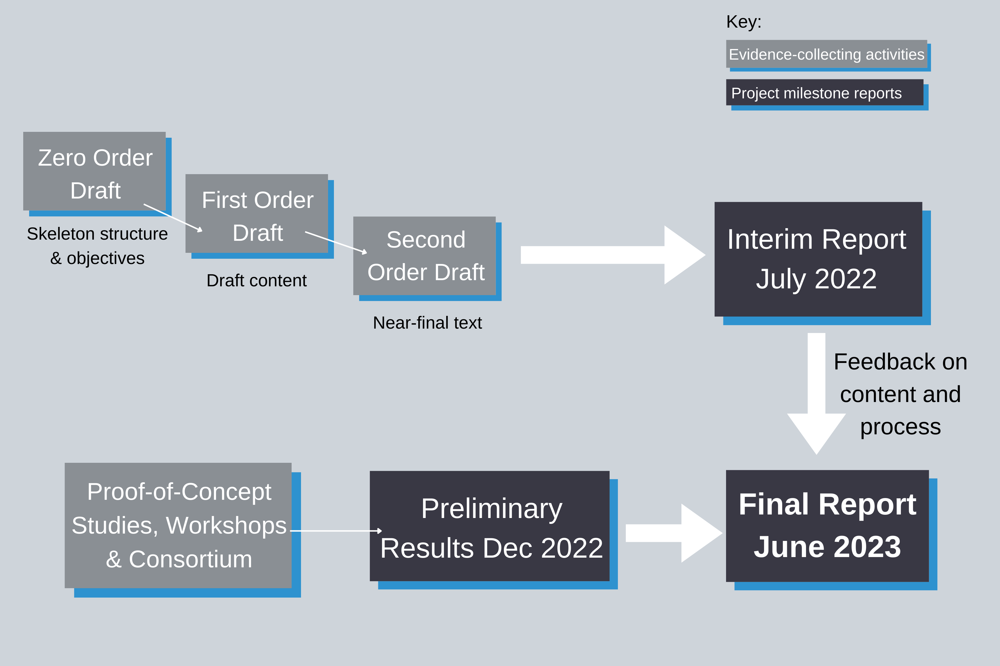

{:class="img-responsive"} 

## What is the project about?

The net-zero-dri scoping project will gather evidence to develop a clear roadmap for [UK Research and Innovation](https://www.ukri.org/) (UKRI) to deliver carbon neutral [digital research infrastructure (DRI)](https://www.ukri.org/our-work/creating-world-class-research-and-innovation-infrastructure/digital-research-infrastructure/) by 2040 or earlier. 

You can find out more in the [overview](/overview/) and [project scope](/scope/) sections of this website. 

## Who is working on the project?

Staff from the [Centre for Environmental Data Analysis (CEDA)](http://www.ceda.ac.uk/). The core project team includes:

 **Project Lead - Martin Juckes**  

Dr Martin Jukes is the Head of Atmospheric Science and Research and deputy head of CEDA. Dr Martin Jukes is the Head of Atmospheric Science and Research and deputy head of CEDA.
 
**Senior Project Manager - Jen Bulpett**  

Jennifer joined CEDA in 2019 and works as a project manager across a number of different projects. Prior to this she was a Technology Consultant at Accenture for over 5 years working with numerous clients across different industries. Jennifer holds a PhD in Physical Chemistry and an MSci (Hons) in Chemistry, both from the University of Bristol. 
 
**Project Manager - Katie Cartmell**  

Katie joined CEDA in March 2022 as a Project Manager. She previously worked at RAL Space as a Project Support Officer. Katie joined CEDA in March 2022 as a Project Manager. She previously worked at RAL Space as a Project Support Officer. 
 
**Science Officer - Charlotte Pascoe**  

Charlotte has extensive experience of the development and application of data models for climate science. Her work has supported model documentation for both the CMIP5 and CMIP6 climate model intercomparison projects. She is an associate member of the IPCC-Data Task Group and works on the IPCC Data Distribution Centre where the focus of her work is making climate data available to the wider climate science community.
 
 
**Communications - Poppy Townsend**  

Poppy’s role as Communications Manager is to promote the work of the Net Zero Scoping Project. Poppy's previous role at CEDA was as a Data Scientist, responsible for providing data management support to researchers, predominantly for projects funded by the Natural Environment Research Council. Poppy holds a MSc in Science Communication from UWE Bristol and a BSc in Ocean Science from Plymouth University.
 
**Technical lead - Ag Stephens**  

 As well as being technical lead on this project, Ag oversees the data pipeline that delivers Petabytes of climate simulations through the Model Intercomparison Projects (such as CMIP5/6) and looks after the UK Climate Projections User Interface which is managed by CEDA and runs on the JASMIN platform. Ag has a keen interest in developing better tools for improving data curation, management and delivery. He also oversees the CEDA training programme.
 
**Summer students - Lucy Woodward** (left) and **Sophie Mosselmans** (right)  

Lucy is a 4th year MSci Physics student at the University of Nottingham with a strong interest in careers in science communication and climate solutions. Sophie is studing her MSci in Physics at Imperial College London and has previously done strategic communications work with the Global Returns Project. They are both supporting Poppy Townsend and the wider team from June to September, before returning to university for their final years.

The team will lead an initial, 19-month UKRI-wide study to survey the digital carbon landscape, run a set of demonstrators and develop a roadmap to ensure that UKRI's data infrastructure can achieve net zero. Taking a systems-based approach, CEDA will work to develop adaptation strategies for the way data is conserved, analysed and managed. 

## When will the project start/end?

The project started in November 2021 and will run for 19 months.  
{:class="img-responsive"} 

## Who funded the project? 

£1.86 million was awarded to the project from UKRI (administered by the [Natural Environment Research Council (NERC)](https://nerc.ukri.org/))
