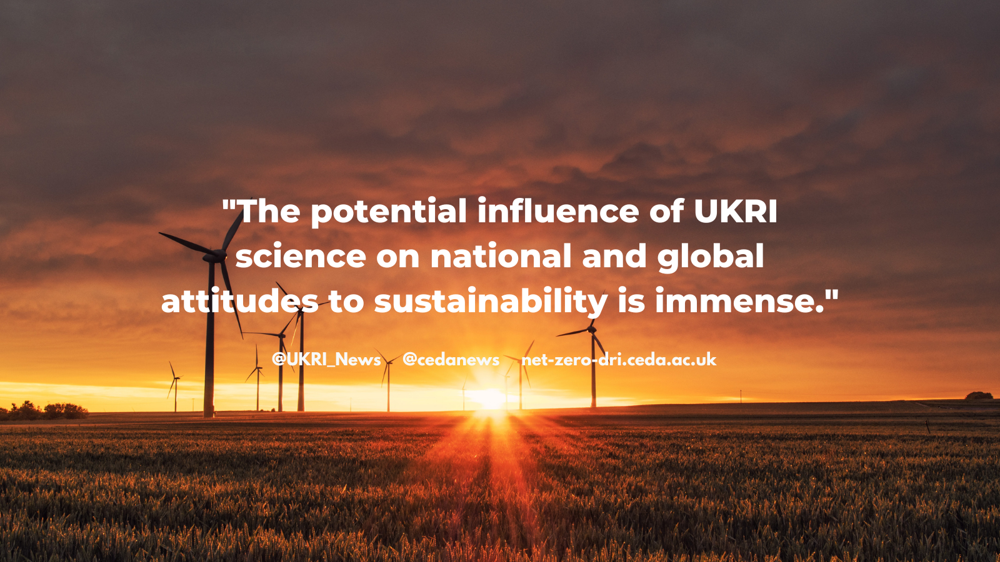

To celebrate [#netzeroweek2022](https://twitter.com/cedanews), read more about the DRI Scoping Project and our partner organisations in our [Net Zero Week article](/news/project-partners/).

{:class="img-responsive"} 

Alt text: Image of a sunset over a wind farm with a quote from our Net Zero Interim Report: "The potential influence of UKRI science on national and global attitudes to sustainability is immense."
