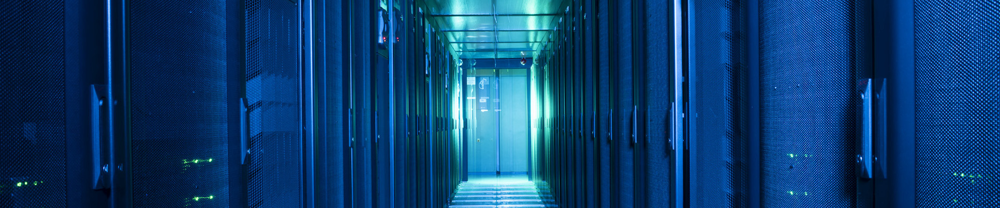

The net-zero-dri scoping project has several focus areas to ensure it provides a clear recommendation on how [UK Research and Innovation](https://www.ukri.org/) (UKRI) can achieve carbon neutral computing by 2040 (or earlier). Further information will be added to this website as the project progresses. 

{:class="img-responsive"} 

### Mapping the current carbon landcape
UKRI doesn't currently have a clear understanding about the carbon footprint of its digital research infrastructure estate. This project will design a detailed database/model which will help map what the current carbon landscape looks like. This will include detailed information, likely to be in a database form, that can be used to support modelling applications. It will also provide interactive visualisations and aggregations of the data - which will help UKRI's future understanding of how it can meet its net zero targets. 

### Developing case studies
The design of the mapping database will be informed by detailed analysis of exemplar national and international infrastructures. Exemplars will be selected on the basis of (1) national or international standing as infrastructure supporting excellent science or analogous non-research services and (2) easy availability of detailed information on carbon footprint associated with a range of services.

{:class="img-responsive"} 

### Bringing together experts 
This project covers the entire UKRI digital research infrastructure estate - from supercomputers to the thousands of staff laptops. We will convene a *Net Zero DRI Consortium* with representatives from across UKRI to contribute both to the formulation of recommendations and the collection of evidence. This will ensure all areas of the organisation are covered by the project. 

### Exploring challenges and opportunities 
A [programme of workshops](/workshops/) will be facilitated to cover the full range of challenges and opportunities around the Net Zero topic. The workshops will cover all the technical themes and gather documented evidence, based on practice and research. 

Some example topics to be explored: 
* Effective Computation: making each simulation count
* Using cloud to enhance efficiency in use of carbon and other resources
* Efficient management of data products 

[Further information about the workshops here](/workshops/). 

{:class="img-responsive"} 

### Funding proof-of-concept studies 
The project will fund ~5 [proof-of-concept studies](/proof-of-concept/) to analyse the implementation of carbon and energy efficiency measures in existing facilities and programmes. They will also determine potential advantages of additional measures or collaboration with existing UKRI funded activities, such as the STFC-led ‘Net-Zero Living Laboratory’. 

[Further information about the proof-of-concept studies here](/proof-of-concept/).

### Investigating funding and system level views 
Existing processes, such as procurement, don't take into account carbon costs. The Net Zero Consortium will conduct a series of meetings, with invited experts as appropriate, to assess the current funding framework for UKRI digital research infrastructure and review the processes in place for the funding of digital research infrastructure procurement, operation, and use. 
