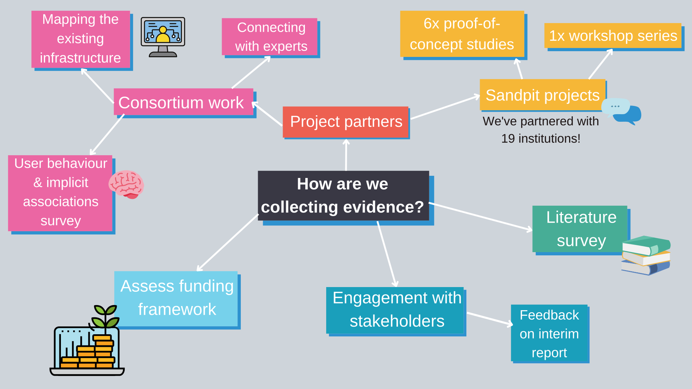

This page details all the information about the work going on to create our net zero roadmap. 
We've partnered with 19 institutions to carry out proof-of-concept studies and workshops as well as funding case studies undertaken by our Consortium. These avenues of research will combine with our literature review and stakeholder engagement to produce a successful final report.

{:class="img-responsive"} 

**Sandpit Projects**  

Learn more about each partner projects by clicking the logos...

  
&nbsp; 
 

  
&nbsp; 

&nbsp; 

ARINZRIT: Learning from the Big Picture: Applying Responsible Innovation to the Net Zero Research Infrastructure Transformation - [find out more here](/arinzrit/)  
ENERGETIC: ENergy-aware hEteRoGenEous compuTIng at sCale - [find out more here](/energetic/)  
GO ZERO: Giving Voice to, and Empowering Stakeholders of UKRI DRI: A Net Zero Workshop Series - [find out more here](/go-zero/)  
HPC JEEP: HPC job efficiency and energy usage: monitoring and reporting - [find out more here](/hpc-jeep/)  
IRISCAST: IRIS Carbon Audit SnapshoT - [find out more here](/iriscast/)  
VALUE: ‘Value’ and Net Zero Decision Making - [find out more here](/value/)  
CQuanDRI: Quantifying the Carbon Emissions of Digital Research Infrastructure - [find out more here](/cquandri/)  

&nbsp; 
&nbsp; 

**Consortium Projects**  

  
&nbsp; 

  
&nbsp; 

In-depth case studies: JASMIN, JADE, Scafell Pike - [find out more here](/jasmin/)  
In depth case study: ARCHER2 - [find out more here](/archer/)  
Mapping the DRI - [find out more here](/mapping/)  
Providing advice and expertise on roadmap development - [find out more here](/roadmap-development/)  
Providing expertise on sustainable computing - [find out more here](/sustainable-computing/)  
Implicit Associations and User Behaviour Survey - [find out more here](/user-behaviour-survey/)  
